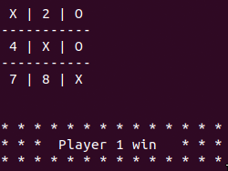

# Tic Tac Toe Game

    A game for two players. 
    The object is to get three in a row. You play on a three by three game board. 
    


    The first player is known as X
    


    and the second is O


    Players alternate placing Xs and Os on the game board
    


    until placing three of their marks in a horizontal, vertical, or diagonal row.
    


    X always goes first, and in the event that no one has three in a row is a draw game.
    


## :package: Built With

    - Ruby
    - Rubocop

### Usage


1) Clone the repository to your local machine
```sh
$ git clone https://github.com/mcervantes71/Tic_Tac_Toe.git
```

2) cd into the directory
```sh
$ cd Tic_Tac_Toe/bin
```

3) Load the module. 
```sh
main
```
[Optional] Create a softlink
```sh
ln -s $PWD/main /usr/local/bin/
```
Now, we're done and we can simply type main to invoke our Tic Tac Toe Game!

## :busts_in_silhouette: Authors

👤 **Edie Atha**

- Linkedin: [Edie Atha](https://www.linkedin.com/in/edieatha/)
- Twitter: [@edieatha](https://twitter.com/edieatha)
- Github: [@edieatha](https://github.com/edieatha)

👤 **Martin Cervantes**

- Linkedin: [Martin Cervantes](https://www.linkedin.com/in/cervantesmartin/)
- Twitter: [@M4rt1nC3rv4nt3s](https://twitter.com/M4rt1nC3rv4nt3s)
- Github: [@mcervantes71](https://github.com/mcervantes71)

## 🤝 Contributing

    Contributions, issues and feature requests are welcome!

Feel free to check the [issues page](../../issues).

## :star2: Show your support

    Give a ⭐️ if you like this project!

## 📝 License

This project is [MIT](lic.url) licensed.
